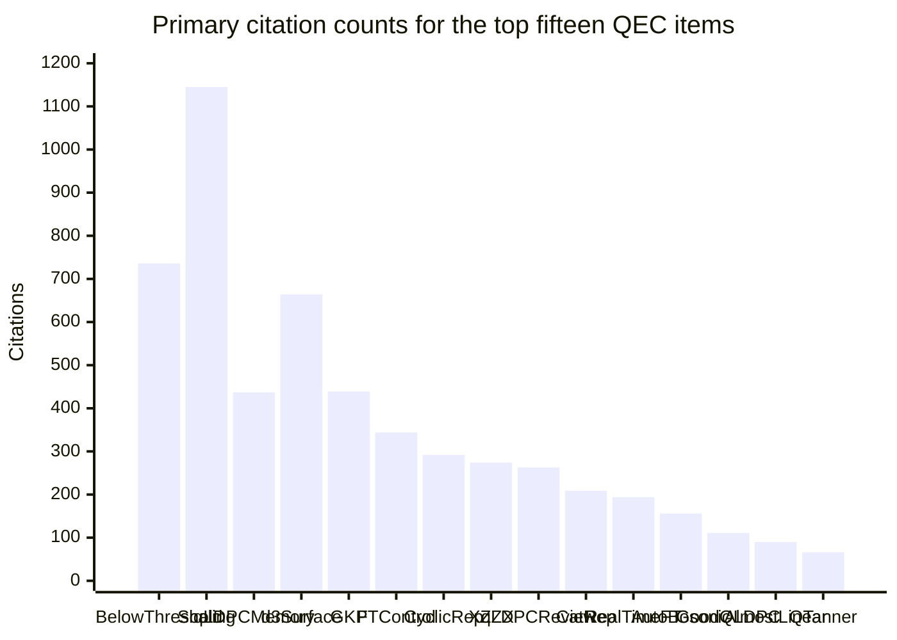
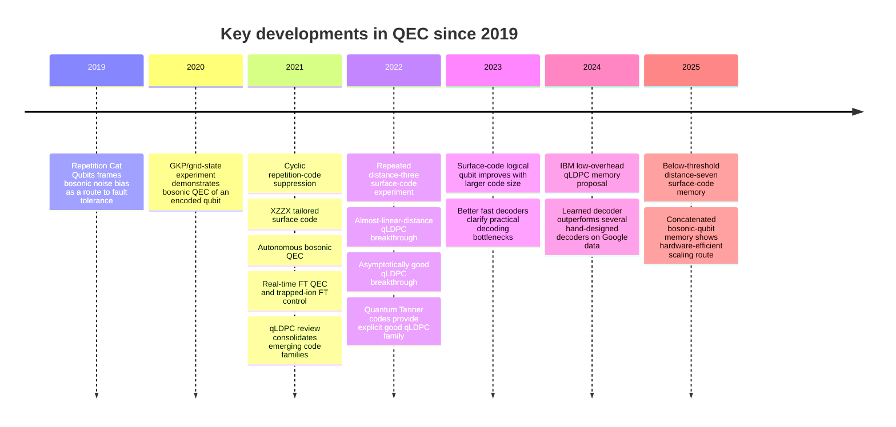

# Recent Developments in Quantum Error Correction

## Executive summary

Since 2018, quantum error correction has moved from **proof-of-principle preservation experiments** to **scaling demonstrations**, **below-threshold logical memories**, and **credible low-overhead alternatives to the surface code**. The strongest experimental arc is in superconducting hardware: Google’s 2023 surface-code scaling paper showed logical improvement with larger code size, and its 2025 follow-on demonstrated a **distance-7 surface-code memory operating below threshold**, with logical suppression improving as code distance increased. In parallel, ETH Zurich’s 2022 distance-three surface-code experiment, trapped-ion demonstrations of fault-tolerant control and real-time feedback, and progress in decoding have made QEC look increasingly like an engineering stack rather than a single isolated protocol. citeturn17search0turn33search0turn29search0turn35search3turn18search2turn28search0

Two other shifts are equally important. First, **bosonic QEC** has become a serious hardware-efficiency strategy rather than a niche subfield: GKP/grid-state experiments, autonomous cat-code protection, and 2025 concatenated bosonic-qubit memories all show that encoded oscillators can reduce overhead by biasing or passively suppressing dominant error channels. Second, **quantum LDPC codes** have gone from aspirational theory to a concrete roadmap: the 2021–2022 breakthroughs of Panteleev and Kalachev, the 2022 Quantum Tanner code construction, and IBM’s 2024 Nature paper on high-threshold, low-overhead fault-tolerant memory made “surface code or bust” an outdated framing. citeturn35search0turn31search0turn32search0turn21search0turn21search1turn19search2turn28search1turn36search1

My overall conclusion is that the **most consequential QEC developments since 2018** are not a single code family, but a convergence of five trends: scalable surface-code experiments, bosonic inner encodings, qLDPC theory maturing into architecture proposals, classical decoding becoming a first-class systems bottleneck, and fault-tolerant logical primitives moving from theory into hardware. The ranked list below weights all five, while still favoring primary papers and high-impact venues. citeturn33search0turn17search0turn28search1turn30search0turn22search0turn28search0

## Ranking methodology

I ranked items using a **combined score** with **60% weight on relevance** and **40% weight on citation impact**. Relevance was scored on a 10-point scale using four criteria: milestone significance for the field, breadth of downstream influence across QEC subfields, practical importance for scalable fault tolerance, and representativeness of one of the major requested themes such as surface codes, bosonic codes, qLDPC codes, subsystem/fault-tolerant protocols, or experimental QEC. Citation impact was **log-scaled** before comparison so that very highly cited papers do not overwhelm newer but field-defining work such as the 2024–2025 below-threshold and qLDPC-memory papers. The final ordering slightly favors **peer-reviewed primary papers over reviews** and **system-level milestones over narrower technical refinements**. citeturn33search0turn17search0turn28search1turn29search0turn35search0turn36search1

For citation counts, I used a **primary source per paper** chosen for consistency and visibility: official publisher-side metrics when present, otherwise Scopus, Scinapse, or a Semantic Scholar-facing mirror/search result when those were the only machine-readable counts available. Because citation databases differ in coverage and update cadence, I report multiple counts where I could verify them; for example, Nature/Scopus differences are already substantial for the 2025 below-threshold paper and Nature/Scinapse differences are substantial for the 2022 ETH surface-code paper. All citation counts below were retrieved on **2026-04-17**. citeturn33search0turn33search2turn29search0turn29search1turn36search1turn19search1

## Top fifteen comparison

The table below summarizes the ranked top 15. The “citations” column lists the primary count first and then a second source when I could verify one independently. The ranking itself is based on the combined relevance-and-citation method described above.

| Rank | Title | Year | Citations by source | Relevance score | Main technique | Experimental or theoretical |
|---|---|---:|---|---:|---|---|
| 1 | *Quantum error correction below the surface code threshold* | 2025 | Nature **736**; Scopus **388** | 10.0 | Distance-7 surface code, real-time decoding, leakage handling | Experimental |
| 2 | *Suppressing quantum errors by scaling a surface code logical qubit* | 2023 | Nature **1145** | 9.8 | Surface-code scaling to distance 5 | Experimental |
| 3 | *High-threshold and low-overhead fault-tolerant quantum memory* | 2024 | Nature **437** | 9.6 | qLDPC memory, bivariate-bicycle family, low-overhead FT memory | Theoretical / architectural |
| 4 | *Realizing repeated quantum error correction in a distance-three surface code* | 2022 | Nature **664**; Scinapse **444** | 9.4 | Repeated superconducting surface-code cycles | Experimental |
| 5 | *Quantum error correction of a qubit encoded in grid states of an oscillator* | 2020 | Nature **439**; Scinapse **350** | 9.1 | GKP/grid-state bosonic QEC | Experimental |
| 6 | *Fault-tolerant control of an error-corrected qubit* | 2021 | Nature **344**; Scinapse **273** | 9.0 | Bacon–Shor logical primitives on trapped ions | Experimental |
| 7 | *Exponential suppression of bit or phase errors with cyclic error correction* | 2021 | Scinapse **292** | 8.9 | Repetition-code QEC with many cycles | Experimental |
| 8 | *The XZZX surface code* | 2021 | Nature Communications **274** | 8.8 | Bias-tailored surface code | Theoretical / numerics |
| 9 | *Quantum Low-Density Parity-Check Codes* | 2021 | Scopus **263**; Scinapse **186** | 8.7 | Perspective/review on qLDPC landscape | Review |
| 10 | *Repetition Cat Qubits for Fault-Tolerant Quantum Computation* | 2019 | Semantic Scholar **209** | 8.6 | Noise-biased cat qubits + repetition outer code | Theoretical |
| 11 | *Realization of Real-Time Fault-Tolerant Quantum Error Correction* | 2021 | Scinapse **194** | 8.5 | Real-time FT QEC with feedback | Experimental |
| 12 | *Protecting a bosonic qubit with autonomous quantum error correction* | 2021 | Nature **156** | 8.3 | Autonomous, dissipation-engineered cat-code protection | Experimental |
| 13 | *Asymptotically good Quantum and locally testable classical LDPC codes* | 2022 | Scinapse **111** | 8.4 | Asymptotically good qLDPC construction | Theoretical |
| 14 | *Quantum LDPC Codes With Almost Linear Minimum Distance* | 2021 | Scinapse **90** | 8.2 | Near-linear-distance qLDPC breakthrough | Theoretical |
| 15 | *Quantum Tanner codes* | 2022 | Scinapse **66**; Emergent Mind page **134** | 8.4 | Explicit good qLDPC via Tanner/Cayley-complex construction | Theoretical |

The main pattern in this top 15 is that **surface-code milestones still dominate experimentally**, while **qLDPC papers dominate the long-range overhead debate** and **bosonic encodings dominate the hardware-efficiency discussion**. The reviews rank lower than the primary breakthroughs because of the weighting scheme, but they remain essential for understanding how the field connects across subareas. citeturn33search0turn17search0turn28search1turn29search0turn35search0turn35search3turn16search6turn35search2turn18search5turn37search3turn19search0turn31search0turn21search1turn21search0turn19search2turn2search4

The bar chart below uses the **primary citation count** listed in the table for each item, again all retrieved on 2026-04-17. citeturn33search0turn17search0turn28search1turn29search0turn35search0turn35search3turn16search6turn35search2turn18search5turn37search3turn19search0turn31search0turn21search1turn21search0turn19search2

The timeline captures the qualitative progression from **noise bias and bosonic ideas**, to **repeated syndrome extraction**, to **logical scaling and below-threshold operation**, and finally to **practical lower-overhead architectures**. citeturn37search0turn35search0turn16search6turn35search2turn18search2turn35search3turn29search0turn19search2turn17search0turn28search1turn28search0turn32search0turn33search0

## Ranked analysis

### Surface-code milestones and decoding

**Rank 1 — *Quantum error correction below the surface code threshold*.**  
**Authors:** Google Quantum AI and Collaborators. **Year:** 2025. **Venue:** *Nature*. **DOI:** 10.1038/s41586-024-08449-y. **Citation count:** Nature **736**; Princeton/Scopus **388**; retrieved 2026-04-17. This is the clearest recent experimental milestone in QEC. The paper reports a **distance-7 surface-code memory** on a 105-qubit Willow processor, shows an error-suppression factor \(\Lambda = 2.14 \pm 0.02\) when increasing code distance by 2, and demonstrates that the logical lifetime exceeds that of the best physical qubit by a factor of about 2.4. It also shows that below-threshold operation can survive **real-time decoding**, not just offline post-processing, which matters enormously for eventual fault-tolerant algorithms. It ranks first because it combines the field’s most important experimental criterion—operation below threshold—with strong systems-level evidence about decoding latency and correlated-error floors. Its main limitation is that it is still a **memory experiment**, not a universal logical-computing stack, and the paper explicitly notes that rare correlated events and scalable classical control remain key bottlenecks. citeturn33search0turn33search2

**Rank 2 — *Suppressing quantum errors by scaling a surface code logical qubit*.**  
**Authors:** Google Quantum AI. **Year:** 2023. **Venue:** *Nature*. **DOI:** 10.1038/s41586-022-05434-1. **Citation count:** Nature **1145**; retrieved 2026-04-17. This paper is the immediate precursor to the below-threshold result and remains one of the most influential QEC papers of the decade. On a 72-qubit superconducting processor, it showed that a **distance-5 surface code** could modestly outperform an ensemble of distance-3 codes and paired that result with long-distance repetition-code studies to expose the role of **high-energy correlated events**. The work was important not only because of the logical-qubit improvement, but because it produced a realistic error-budget narrative for what blocks further scaling. It is highly relevant because it changed the conversation from “can we repeatedly extract syndromes?” to “can bigger codes actually help on real hardware?” Its limitations are equally clear: the improvement was narrow, not below-threshold, and the repetition-code floor exposed correlated faults that standard phenomenological models do not fully capture. citeturn17search0turn17search2

**Rank 4 — *Realizing repeated quantum error correction in a distance-three surface code*.**  
**Authors:** Sebastian Krinner, Nathan Lacroix, Ants Remm, Agustin Di Paolo, Elie Genois, Catherine Leroux, Christoph Hellings, Stefania Lazar, Francois Swiadek, Johannes Herrmann, Graham J. Norris, Christian Kraglund Andersen, Markus Müller, Alexandre Blais, Christopher Eichler, Andreas Wallraff. **Year:** 2022. **Venue:** *Nature*. **DOI:** 10.1038/s41586-022-04566-8. **Citation count:** Nature **664**; Scinapse **444**; retrieved 2026-04-17. This ETH Zurich/Sherbrooke experiment is one of the most technically disciplined repeated surface-code demonstrations. Using 17 superconducting qubits, it implemented fast **distance-three** cycles, decoded both bit- and phase-flip syndromes with MWPM, and reported low logical error per cycle when leakage-detected runs were rejected. Its relevance comes from showing that repeated cycles could be run at competitive speed and fidelity on a compact hardware stack, helping validate the modern superconducting-surface-code paradigm outside Google’s devices. The limitation is obvious: distance three corrects only a single fault, and the post-selected leakage handling made the result less directly scalable than later below-threshold studies. citeturn29search0turn29search1

**Rank 7 — *Exponential suppression of bit or phase errors with cyclic error correction*.**  
**Authors:** Google Quantum AI. **Year:** 2021. **Venue:** *Nature*. **DOI:** 10.1038/s41586-021-03588-y. **Citation count:** Scinapse **292**; retrieved 2026-04-17. This repetition-code paper was the first convincing modern demonstration that running more QEC cycles on more qubits could suppress logical error **exponentially** in a cyclic experiment. It is not a full two-dimensional surface code, but it tested precisely the kind of repeated stabilizer extraction, decoder behavior, and temporal stability needed for later surface-code work. Its relevance is therefore infrastructural: it established a credible stepping-stone from physical qubits to logical memories on superconducting hardware. Its limitation is that repetition codes correct only one Pauli type and therefore do not by themselves support general quantum computation. citeturn8search2turn16search6

**Rank 8 — *The XZZX surface code*.**  
**Authors:** J. Pablo Bonilla Ataides, David K. Tuckett, Stephen D. Bartlett, Steven T. Flammia, Benjamin J. Brown. **Year:** 2021. **Venue:** *Nature Communications*. **DOI:** 10.1038/s41467-021-22274-1. **Citation count:** Nature Communications **274**; retrieved 2026-04-17. The XZZX code is the most important surface-code design innovation of the past several years. The paper showed that a simple checkerboard Hadamard deformation yields a surface code with remarkably strong performance under **biased noise**, including thresholds competitive with hashing bounds and much lower overhead in dephasing-dominated regimes. It is highly relevant because real devices rarely suffer fully symmetric depolarizing noise; bias-aware codes are one of the cleanest examples of the field adapting codes to hardware rather than forcing hardware to emulate a textbook error model. The main limitation is that advantages depend on sufficiently biased noise and on decoders that can exploit the bias well; under more generic circuit-level noise, the gains can be smaller than the most optimistic headline suggests. citeturn35search2turn23search0

### qLDPC theory and low-overhead architectures

**Rank 3 — *High-threshold and low-overhead fault-tolerant quantum memory*.**  
**Authors:** Sergey Bravyi, Andrew W. Cross, Jay M. Gambetta, Dmitri Maslov, Patrick Rall, Theodore J. Yoder. **Year:** 2024. **Venue:** *Nature*. **DOI:** 10.1038/s41586-024-07107-7. **Citation count:** Nature **437**; retrieved 2026-04-17. This paper is the most important bridge yet between abstract qLDPC theory and a plausible near-term architecture. It proposed an end-to-end FT memory protocol based on a family of high-rate LDPC codes, giving a threshold around **0.7–0.8%**, on par with the surface code, while arguing for an order-of-magnitude reduction in qubit overhead for a representative memory task. That makes it one of the first papers to turn “qLDPC is asymptotically attractive” into “qLDPC may matter experimentally soon.” The limitations are substantial, however: it is still a design-and-simulation paper rather than a hardware realization, and routing, decoder latency, and syndrome-extraction complexity remain much less mature than for the surface code. citeturn28search1turn11search3

**Rank 9 — *Quantum Low-Density Parity-Check Codes*.**  
**Authors:** Nikolas P. Breuckmann, Jens Niklas Eberhardt. **Year:** 2021. **Venue:** *PRX Quantum*. **DOI:** 10.1103/PRXQuantum.2.040101. **Citation count:** Scopus **263**; Scinapse **186**; retrieved 2026-04-17. This review became the standard entry point into modern qLDPC thinking. It synthesized product constructions, hypergraph-product ideas, distance-rate tradeoffs, and open decoding problems at exactly the moment the field began moving beyond surface-code exclusivity. Its relevance is high because later breakthroughs in qLDPC were understood, taught, and benchmarked against the categories this review helped consolidate. As a review, it does not itself introduce a new code family, and some of its open-problem framing has been overtaken by the rapid post-2021 breakthroughs. citeturn36search1turn19search1turn18search5

**Rank 13 — *Asymptotically good Quantum and locally testable classical LDPC codes*.**  
**Authors:** Pavel Panteleev, Gleb Kalachev. **Year:** 2022. **Venue:** STOC. **DOI:** 10.1145/3519935.3520017. **Citation count:** Scinapse **111**; retrieved 2026-04-17. This is one of the decisive papers in the qLDPC revolution. It showed explicit families of **asymptotically good quantum LDPC codes**, overcoming a long-standing barrier in the field and changing what “plausible low-overhead fault tolerance” means in principle. Its relevance is not only mathematical: it reshaped architectural roadmaps by making constant-rate, linear-distance quantum LDPC coding a serious target. The limitation is practical; the construction is sophisticated, the constants are not obviously hardware-friendly, and efficient decoding for realistic noise models remains a central open problem. citeturn21search1

**Rank 14 — *Quantum LDPC Codes With Almost Linear Minimum Distance*.**  
**Authors:** Pavel Panteleev, Gleb Kalachev. **Year:** 2021. **Venue:** *IEEE Transactions on Information Theory*. **DOI:** 10.1109/TIT.2021.3119384. **Citation count:** Scinapse **90**; retrieved 2026-04-17. This paper was the major prelude to the fully “good” qLDPC breakthrough. It showed quantum LDPC codes with **almost linear minimum distance**, proving that the old square-root-distance barrier could be beaten dramatically and setting up the subsequent asymptotically good constructions. It is relevant because it was the moment many researchers stopped treating qLDPC as a niche alternative and started treating it as a genuine contender for lower-overhead fault tolerance. The limitation is that “almost linear” is not yet the full constant-rate, linear-distance story, and the constructions were still far from turnkey experimental deployment. citeturn21search0

**Rank 15 — *Quantum Tanner codes*.**  
**Authors:** Anthony Leverrier, Gilles Zémor. **Year:** 2022. **Venue:** FOCS. **DOI:** 10.1109/FOCS54457.2022.00117; **arXiv:** 2202.13641. **Citation count:** Scinapse **66**; a separate Emergent Mind page reports **134**; retrieved 2026-04-17. Quantum Tanner codes matter because they provided a particularly transparent and explicit route to **good qLDPC codes** using Tanner-style ideas on left-right Cayley complexes. Compared with the denser algebraic constructions that preceded them, they made the emerging qLDPC story easier to reason about and easier to connect to decoding and expansion tools. Their relevance is therefore disproportionately high relative to raw citation counts: they are a conceptual organizing point for much of the current qLDPC literature. Their limitations mirror the broader qLDPC limitations—finite-length performance, practical decoding under circuit noise, and hardware-compatible syndrome extraction are still unsettled. citeturn19search2turn8search5turn2search4

### Bosonic codes and noise bias

**Rank 5 — *Quantum error correction of a qubit encoded in grid states of an oscillator*.**  
**Authors:** Philippe Campagne-Ibarcq, Alec Eickbusch, Steven Touzard, et al.; Michel H. Devoret. **Year:** 2020. **Venue:** *Nature*. **DOI:** 10.1038/s41586-020-2603-3. **Citation count:** Nature **439**; Scinapse **350**; retrieved 2026-04-17. This Yale experiment is the canonical modern GKP/grid-state milestone. It experimentally prepared square and hexagonal GKP states in a superconducting cavity and demonstrated QEC of the encoded qubit with suppression of logical errors, closely matching theoretical estimates built from measured imperfections. Its relevance is enormous because GKP-style bosonic encodings are among the strongest contenders for **hardware-efficient inner codes**, especially in concatenated architectures. The main limitation is the demanding state-preparation and control overhead: the paper proves feasibility, but not yet the simplest road to large-scale architectures. citeturn35search0turn17search1

**Rank 10 — *Repetition Cat Qubits for Fault-Tolerant Quantum Computation*.**  
**Authors:** Jérémie Guillaud, Mazyar Mirrahimi. **Year:** 2019. **Venue:** *Physical Review X*. **DOI:** 10.1103/PhysRevX.9.041053. **Citation count:** Semantic Scholar **209**; retrieved 2026-04-17. This paper was the blueprint for the now-dominant cat-qubit argument: if hardware can bias noise strongly enough, then an outer repetition code may replace much of the overhead of more symmetric qubit encodings. It proposed a universal, hardware-efficient FT scheme built on dissipative cat qubits and explicitly highlighted the possibility of avoiding magic-state distillation overhead in the most naive form. Its relevance comes from being the conceptual ancestor of much of the recent cat-qubit and concatenated-bosonic literature, including the 2025 Nature concatenated bosonic result. Its limitation is that it remained a proposal; later work had to confront the nontrivial problem of preserving bias during entangling gates and syndrome extraction. citeturn37search0turn37search3

**Rank 12 — *Protecting a bosonic qubit with autonomous quantum error correction*.**  
**Authors:** Jeffrey M. Gertler, Brian Baker, Juliang Li, Shruti Shirol, Jens Koch, Chen Wang. **Year:** 2021. **Venue:** *Nature*. **DOI:** 10.1038/s41586-021-03257-0. **Citation count:** Nature **156**; retrieved 2026-04-17. This paper showed that not all useful QEC has to be measurement-heavy and feedback-heavy. By engineering dissipation to stabilize photon-number parity in a cat-like bosonic qubit, it demonstrated **autonomous correction of single-photon-loss errors** and more than doubled coherence time in a comparatively modest hardware stack. It is relevant because it opened a practical design space between fully passive bosonic protection and fully active, code-cycle-heavy QEC. The limitation is that autonomous protection corrects only a restricted set of errors and still needs integration with broader FT schemes to become a complete architecture. citeturn31search0

### Fault-tolerant control, subsystem ideas, and real-time feedback

**Rank 6 — *Fault-tolerant control of an error-corrected qubit*.**  
**Authors:** Laird Egan, Dripto M. Debroy, Crystal Noel, Andrew Risinger, Daiwei Zhu, Debopriyo Biswas, Michael Newman, Muyuan Li, Kenneth R. Brown, Marko Cetina, Christopher Monroe, et al. **Year:** 2021. **Venue:** *Nature*. **DOI:** 10.1038/s41586-021-03928-y. **Citation count:** Nature **344**; Scinapse **273**; retrieved 2026-04-17. This trapped-ion experiment is a landmark because it focused not only on preserving logical information, but on **fault-tolerant logical control**: state preparation, measurement, rotation, and stabilizer measurement on a Bacon–Shor logical qubit. That matters because many early QEC demonstrations stored quantum information better than raw qubits, but did not show that logical operations themselves were being executed in a fault-tolerant way. It is highly relevant to subsystem-code and FT-protocol research because it validates the basic engineering logic of fault containment at the logical layer. The limitation is scale: the code distance is still small, and the work does not yet show full algorithmic logical computation with strong asymptotic improvement. citeturn35search3turn20search2

**Rank 11 — *Realization of Real-Time Fault-Tolerant Quantum Error Correction*.**  
**Authors:** Ciarán Ryan-Anderson, J. G. Bohnet, K. Lee, D. Gresh, A. Hankin, J. P. Gaebler, D. Francois, A. Chernoguzov, D. Lucchetti, et al.; Quantinuum team. **Year:** 2021. **Venue:** *Physical Review X*. **DOI:** 10.1103/PhysRevX.11.041058. **Citation count:** Scinapse **194**; retrieved 2026-04-17. This paper demonstrated that mid-circuit measurement, conditional branching, and repeated recovery can be executed in real time on trapped ions while the computation is running. That is a systems milestone, not just a code milestone, because real-time adaptation is unavoidable for useful FT protocols involving teleportation, syndrome-based branching, and non-Clifford resources. It is especially relevant now that below-threshold memories are shifting attention to the **classical coprocessor** and control plane. The limitation is similar to other early FT experiments: the distances are small and the work is better understood as a demonstration of a full control loop than as a proof of scalable asymptotic suppression. citeturn18search2turn19search0

## Review articles and follow-up readings

If you want to go deeper after the top-15 list, these are the most useful reviews and near-frontier papers to read next.

**Primary reviews and perspectives.**  
Breuckmann and Eberhardt’s *Quantum Low-Density Parity-Check Codes* is still the cleanest short review of qLDPC structures and open problems. Grimsmo and Puri’s *Quantum Error Correction with the Gottesman–Kitaev–Preskill Code* is the best compact entry point for bosonic/GKP ideas in the modern hardware era. Earl Campbell’s 2024 *Nature Reviews Physics* year-in-review article is brief but very useful for contextualizing how 2023 shifted the QEC agenda toward early error-corrected computation. Finally, the 2024 invited review *Advances in bosonic quantum error correction with Gottesman–Kitaev–Preskill Codes* is worth reading if you want a more detailed bosonic-code survey than the short PRX Quantum perspective provides. citeturn36search1turn30search0turn12search0turn36search9

**Important near-frontier papers just outside the top 15.**  
I would especially recommend *Learning high-accuracy error decoding for quantum processors* for the decoding layer, *Parallel window decoding enables scalable fault tolerant quantum computation* for the classical-backlog problem, *Hardware-efficient quantum error correction via concatenated bosonic qubits* for the newest cat-code hardware direction, *Protecting entanglement between logical qubits via quantum error correction* for multi-logical-qubit bosonic experiments, and *Fault-Tolerant Operation of Bosonic Qubits with Discrete-Variable Ancillae* for the hybrid ancilla–boson FT framework. These do not all rank in the top 15 because of either recency or narrower scope, but they are among the best indicators of where the field is going next. citeturn28search0turn22search0turn32search0turn25search0turn25search1

## Open research questions and outlook

The clearest open problem is **how to suppress rare correlated faults** strongly enough that below-threshold memories can become truly computation-ready. Both Google’s 2023 and 2025 papers emphasize that high-energy or otherwise correlated fault events can create logical error floors that are invisible in simpler stochastic models, so the field still lacks a complete recipe for ultra-low logical error rates in realistic devices. citeturn17search0turn33search0

A second central question is whether **qLDPC codes can become as operationally mature as the surface code** before the surface code itself becomes “good enough.” Theoretical breakthroughs and IBM’s low-overhead memory proposal are compelling, but real progress still depends on hardware-compatible layouts, repeated syndrome extraction, and decoders that remain fast and accurate under circuit-level noise, not just code-capacity models. citeturn28search1turn21search1turn21search0turn19search2

A third question is whether **bosonic encodings can preserve noise bias during all required operations**, especially two-mode gates and syndrome extraction. Cat codes and GKP encodings are appealing because they can substantially reduce overhead, but the engineering challenge is to ensure that ancilla errors and gate imperfections do not erase the very bias that makes the encoding attractive. citeturn37search0turn35search0turn25search1turn32search0

A fourth question is about the **classical side of fault tolerance**. Real-time decoding, low-latency feed-forward, and scalable parallel classical pipelines are no longer peripheral concerns; they are now part of the threshold problem itself. The recent literature shows that decoder quality and decoder latency both materially affect whether an otherwise good logical qubit is actually useful. citeturn33search0turn22search0turn28search0turn18search2

A fifth question is architectural: **which hybrid stack will win**—surface code plus better hardware, qLDPC plus more complex connectivity, bosonic inner codes plus simple outer codes, or some heterogeneous combination of these? The strongest recent evidence suggests that the eventual answer may not be a single family, but layered architectures that use one code to exploit hardware bias and another to provide scalable fault tolerance across modules. citeturn28search1turn32search0turn35search2turn30search4